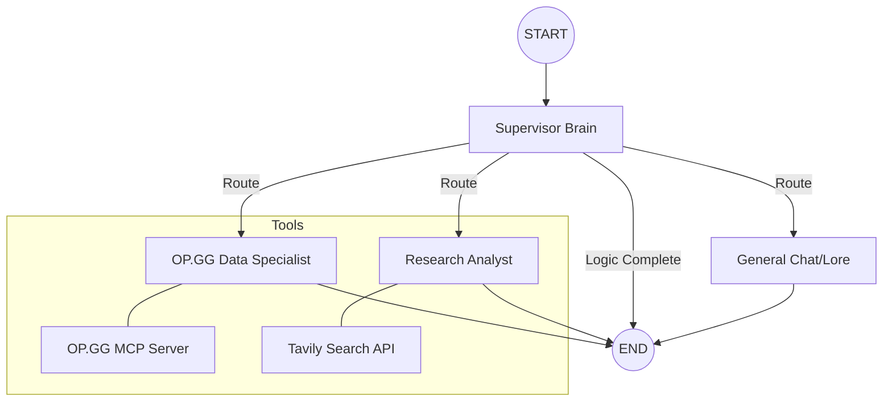

# 🎮 League of Legends Agentic AI

A high-performance, multi-agent system designed to provide real-time League of Legends analytics, meta-research, and player insights. Powered by **LangGraph**, **Qwen 2.5 72B (Ollama)**, and the **Model Context Protocol (MCP)**.

## 🏗️ Agent Architecture



## 🚀 Overview
This project orchestrates multiple specialized AI agents to assist players and analysts:
- **Supervisor (The Brain):** Manages routing and state using structured output. Decides which specialist to call based on the user's intent.
- **OPGGWorker:** Interfaces with a custom Node.js MCP server to fetch live champion stats, player ranks, and match histories.
- **ResearchWorker:** Performs autonomous web research using Tavily to synthesize community sentiment, Reddit threads, and latest patch notes.
- **GeneralAgent:** Handles casual interaction, greetings, and game lore.

## 🛠️ Tech Stack
- **LLM:** Qwen 2.5 72B via **Ollama** (Optimized for RTX 6000/95GB VRAM)
- **Orchestration:** LangGraph (Python)
- **API Framework:** FastAPI & Uvicorn
- **Dependency Management:** [uv](https://github.com/astral-sh/uv)
- **Tools:** Tavily Search, OP.GG MCP Server (Node.js/TypeScript)
- **Containerization:** Docker & Docker Compose

## 📦 Installation & Setup

### 1. Prerequisites
- [Ollama](https://ollama.com/) installed on host with `qwen2.5:72b` pulled.
- [Tavily API Key](https://tavily.com/) for web research.

### 2. Environment Variables
Create a `.env` file in the root directory:
```env
TAVILY_API_KEY=tvly-your-key
OLLAMA_BASE_URL=http://host.docker.internal:11434
OPGG_MCP_PATH=./opgg-mcp/dist/index.js
```

### 3. Running with Docker
The system is fully containerized. To build and start the API:
```bash
docker compose up --build -d
```

## 🧪 Testing
You can test the agent logic directly inside the containerized environment:
```bash
docker compose exec -it agent-api uv run test/test_full_agent.py
```

Or interact with the FastAPI documentation at `http://localhost:8000/docs`.

## 🛠️ Project Structure
- `app/agent/nodes/`: Contains the logic for the Supervisor and individual Worker agents.
- `app/agent/graph.py`: Defines the LangGraph state machine and routing logic.
- `opgg-mcp/`: A specialized Node.js server implementing the Model Context Protocol for OP.GG data.
- `test/`: Diagnostic scripts for testing tool connectivity and agent reasoning.