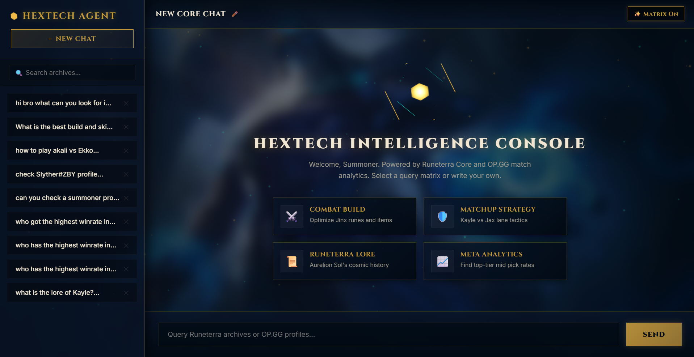
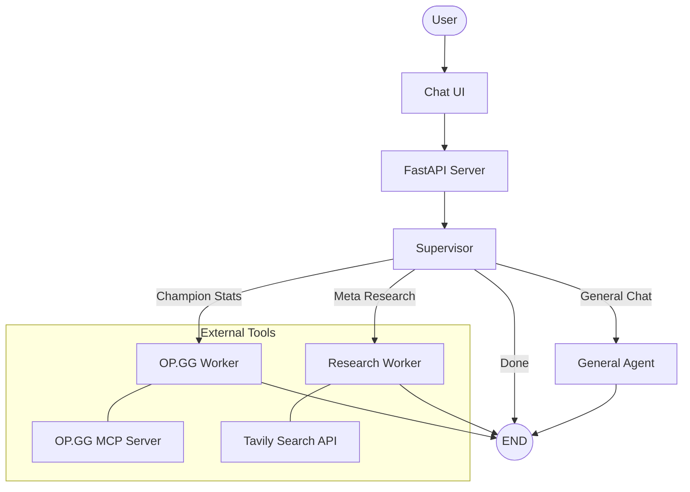

# 🎮 League of Legends Agentic AI

A multi-agent system that provides real-time League of Legends analytics, meta-research, and player insights through a chat interface. Powered by **LangGraph**, **Google Gemini 2.5 Flash** (via OpenRouter), and the **Model Context Protocol (MCP)**.

<p align="center">
  
</p>

<p align="center">
  
  
  
  
</p>

---

## 🏗️ Architecture



### Agent Roles

| Agent | Responsibility |
|---|---|
| **Supervisor** | Analyzes user intent and routes to the appropriate specialist using structured output |
| **OP.GG Worker** | Fetches live champion stats, win rates, builds, and player profiles via a local MCP server |
| **Research Worker** | Performs web research using Tavily to synthesize patch notes, tier lists, and community sentiment |
| **General Agent** | Handles casual conversation, greetings, and game lore questions |

---

## 🛠️ Tech Stack

| Layer | Technology |
|---|---|
| **LLM** | Google Gemini 2.5 Flash via [OpenRouter](https://openrouter.ai/) |
| **Orchestration** | [LangGraph](https://github.com/langchain-ai/langgraph) (multi-agent state machine) |
| **API** | FastAPI + Uvicorn |
| **Frontend** | Modern React SPA (Vite) with custom Hextech design system |
| **Memory** | PostgreSQL checkpointer (async, via `psycopg3` & `AsyncConnectionPool`) |
| **Tools** | [Tavily Search](https://tavily.com/), [OP.GG MCP Server](./opgg-mcp/) (Node.js/TypeScript) |
| **Package Manager** | [uv](https://github.com/astral-sh/uv) |
| **Containerization** | Docker & Docker Compose |

---

## 📦 Getting Started

### Prerequisites

- [Docker](https://www.docker.com/) installed
- An [OpenRouter API Key](https://openrouter.ai/) (or configure an alternative LLM provider)
- A [Tavily API Key](https://tavily.com/) for web research

### Environment Variables

Create a `.env` file in the project root:

```env
OPENROUTER_API_KEY=sk-or-v1-your-key
TAVILY_API_KEY=tvly-your-key
OPGG_MCP_PATH=./opgg-mcp/dist/index.js
```

### Running with Docker

```bash
docker compose up --build -d
```

The app will be available at **http://localhost:8000**.

### Running Locally (without Docker)

```bash
# Install dependencies
cd backend
uv sync

# Build the OP.GG MCP server
cd ../opgg-mcp && npm install && npm run build && cd ..

# Build the React Frontend
cd frontend && npm install && npm run build && cd ..

# Start the server
cd backend
uv run python main.py
```

The browser will open automatically to **http://127.0.0.1:8000**.

---

## 🧪 Testing

Run individual agent tests inside the container:

```bash
# Full agent integration test
docker compose exec agent-api uv run test/test_full_agent.py

# OP.GG worker test
docker compose exec agent-api uv run test/test_opgg_node.py

# Research worker test
docker compose exec agent-api uv run test/test_research_node.py
```

Or interact with the API docs at **http://localhost:8000/docs**.

---

## 📂 Project Structure

```
.
├── backend/
│   ├── app/
│   │   ├── api.py                     # FastAPI app, logging config, endpoints
│   │   └── agent/                     # LangGraph state machine & routing
│   ├── test/                          # Agent & tool diagnostic scripts
│   ├── logs/                          # Rotating log files (auto-generated)
│   ├── main.py                        # Local dev entrypoint
│   └── pyproject.toml                 # Python dependencies (managed by uv)
├── frontend/                          # React + Vite Frontend
│   ├── src/                           # React Components and Hooks
│   ├── index.html                     # Vite Entrypoint
│   └── package.json                   # UI Dependencies
├── opgg-mcp/                          # OP.GG MCP server (Node.js/TypeScript)
├── Dockerfile                         # Multi-stage container build
└── docker-compose.yml                 # Service orchestration
```

---

## 📋 Logging

Logs are written to `logs/sessions.log` with automatic rotation (5 MB per file, 3 backups). Third-party library noise (aiosqlite, httpcore, httpx) is suppressed to `WARNING` level, keeping logs focused on application events.

**Format:**
```
2026-05-14 00:20:24 | INFO     | lol_agent            | api.lifespan:42 | AsyncSqliteSaver successfully initialized.
2026-05-14 00:20:41 | INFO     | lol_agent            | api.chat_endpoint:62 | Session thread_abc123 - New Message: hi
```

---

## 📄 License

This project is for educational and personal use.